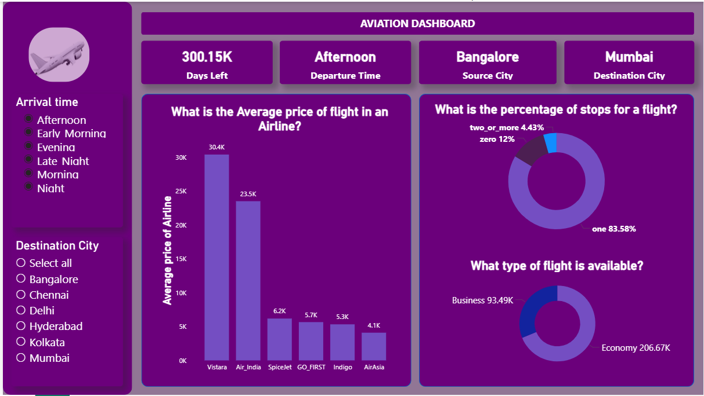

# ✈️ Flight Airline Dashboard

## 📊 Project Overview
This project presents an interactive Flight Airline Dashboard created to analyze airline travel data and uncover useful insights about flight pricing, travel patterns, and airline service classes.

The dashboard helps users understand how flight prices vary, the percentage of flights with stops, and the distribution of flight classes such as Business and Economy.

This project demonstrates practical data analysis and dashboard design skills using real-world airline data.

---

## 🎯 Project Objectives
The dashboard answers the following key questions:

- What is the **average price of flights**?
- What **percentage of flights have stops**?
- What **types of travel classes are available**?
- How are flights distributed based on **arrival time**?
- Which **destination cities receive the most flights**?

---

## 📁 Dataset Description
The dataset contains airline flight information including:

- Airline name  
- Source city  
- Destination city  
- Departure time  
- Arrival time  
- Number of stops  
- Ticket price  
- Travel class (Business / Economy)

The data was cleaned and prepared before building the dashboard.

---

## 🛠 Tools Used
- **Power BI** – Dashboard development and visualization  
- **Excel / SQL** – Data cleaning and preparation  
- **GitHub** – Project documentation and version control  

---

## 📈 Dashboard Features

### Average Flight Price
Displays the overall average price of flights.

### Stops Distribution
Shows the percentage of flights that are:
- Direct flights
- One stop
- Multiple stops

### Flight Class Distribution
Compares the availability of:
- Business Class
- Economy Class

### Arrival Time Analysis
Analyzes how flights are distributed based on arrival time.

### Destination City Analysis
Identifies the cities that receive the highest number of flights.

### Interactive Filters
Users can filter the dashboard by:
- Arrival Time
- Destination City

---

## 📷 Dashboard Preview

Add your dashboard screenshots here.

Example:

---

## 🔍 Key Insights
Some insights discovered from the analysis include:

- The **average flight price** gives an overview of airline ticket costs.
- Many flights include **one stop**, indicating connecting flights are common.
- **Economy class flights** are more frequent than business class flights.
- Some destination cities receive **significantly more flights** than others.

---

## 🚀 Purpose of the Project
This project is part of my journey to becoming a **Data Analyst**.  
I am building and sharing real-world data projects to improve my skills in data analysis, visualization, and storytelling.

---

---

⭐ If you found this project interesting, consider giving the repository a star!
